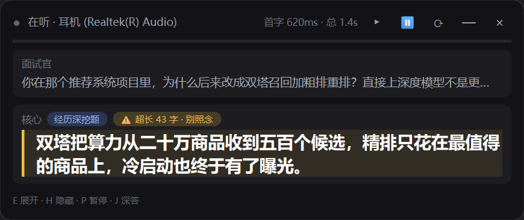
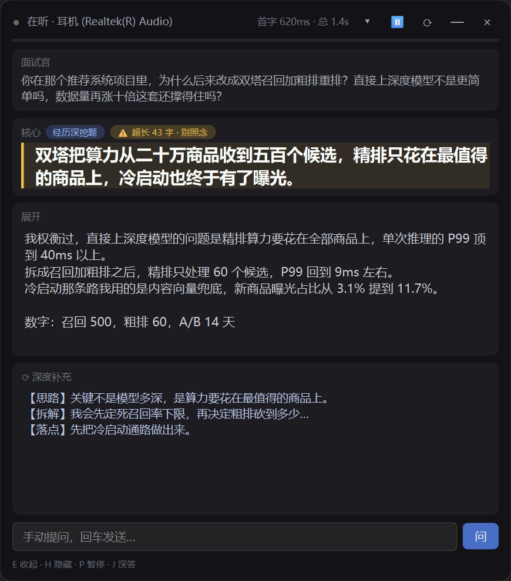
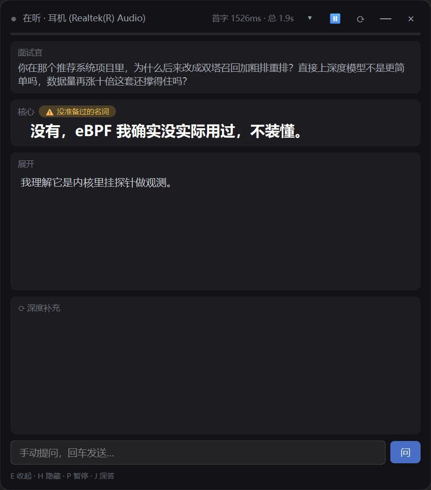

# EarShot（顺风耳）· 使用说明书

> 实时面试提词器 · Windows 桌面浮窗
> 抓扬声器回环（只抓面试官）→ 本地离线识别 → 本地 BM25 检索你自己的面试材料 → DeepSeek 流式生成「可照念」的口语答案 → 置顶浮窗上屏。

> 本文的性能数字全部是本机实测值，不是估算；标注「待补」的地方是还没验证过的，别当成已知。

---

## 〇、三分钟上手

1. **放对路径**（最容易翻车的一步）。仓库可以放在中文路径下，但 **ASR 模型目录必须是纯 ASCII**：
   - 首选整个仓库放 ASCII 路径，例如 `G:/EarShot/`；
   - 若仓库在中文路径下（例如 `C:/dev/EarShot/`），把模型单独放到 `C:/asr-models/SenseVoiceSmall-onnx`，并在 `config/settings.json` 里把 `model_dir` 指过去。
   - 原因见 `docs/常见问题FAQ.md` 里的「为什么模型必须放纯 ASCII 路径」。
2. **配密钥**：复制 `config/settings.example.json` 为 `config/settings.json`（不改也能跑，全用默认值），把 DeepSeek 密钥写进 `config/api_key.txt`（一行，不加引号）。
3. **下模型**：`python tools/download_model.py` —— 从 ModelScope 拉 `iic/SenseVoiceSmall-onnx`（约 230 MB，纯标准库实现）。
4. **放材料**：把简历、项目深度报告、数据汇总、话术稿放进 `knowledge/`（默认语料 glob 就是 `knowledge/**/*.md` 与 `knowledge/**/*.txt`）。
5. **会前自检**：`python tools/preflight.py --fast`（本机 8.4 秒出 12 项 PASS/FAIL/WARN；不加 `--fast` 约 26 秒，多跑 ASR 识别、浮窗自检与选库窗口自检）。有 FAIL 就别硬上。
6. **启动**：双击 `启动提词器.bat` —— **先弹「选择知识库」窗口**：选一个库，或点「＋ 新建知识库」把这家公司的材料交给它（见下面第 6.1 条）；
   选中后点右下角「开始 ▶」，**这个窗口自动关掉**，接着才起后端和浮窗（逻辑在 `tools/launch.py`，幂等：后端已在跑就不再起第二个，
   浮窗已开就不再开第二个；**换库时会先把装了旧库的后端停掉再起**，否则它答的还是上一个库的材料；
   它会轮询 `/healthz`，等模型真的加载完才拉浮窗）。**启动到浮窗可用约 24 秒**（模型加载 + 建索引 + 答题链路预热）。

6.1 **新建一个库**（换一家公司面试时才需要）：在选库窗口点「＋ 新建知识库」，起个库名，把**专属文档**（这家公司的 JD、公司介绍、
   岗位相关材料）选进去；简历、项目报告这类**所有场次都用得上的**放进「其他 / 补充文档」——它们会进共用的 `knowledge/_base/`。
   支持 `.md` / `.txt`，**`.docx` 会自动转成 markdown**（纯标准库，不用装 Office）。
   下面还能填一句「公司背景」，它会变成这个库的 `company.md`，每道题都会带进上下文（留空也行，之后能补）。
   库里第一次用会先备题库（约 1 分钟，窗口上有提示），之后切回来是秒级。
6.2 **也可以直接用打包好的 exe 启动，机器上不用装 Python**：双击 `dist/EarShot/EarShot.exe`
    （仓库根留了个快捷方式 `顺风耳-EarShot.lnk`），之后的流程和第 6 步一模一样。
    启动时间与源码模式相当（同口径实测：到后端就绪 exe 21.6 秒 / 源码 24.1 秒），不会更慢。
    分发时要连 `_internal/` 整个文件夹一起拷，打包与排错见 `docs/打包成exe.md`。

7. **试一次回环**：随便播一段音频，看浮窗的电平条会不会动、「面试官」框会不会出字。
8. **试一次提问**：按展开键（默认 Ctrl+Shift+E）露出底部输入行，手打一句问题回车——确认答案能流式上屏。

> 首次识别含 numba JIT 编译要 **21.7 秒**，预热后约 **100 ms**。启动阶段已经替你做掉这次预热——**别在面试开始之后才第一次启动**。

---

## 一、它是什么 / 一句话原理

线上面试时，面试官的声音从扬声器或耳机出来。EarShot 抓的是**系统回环音频**——操作系统要播放出去的那一路渲染流，也就是面试官的声音。它**完全不碰麦克风**，所以你的声音永远不会被转写，也就不需要做声纹分离。

抓到的音频在本机：

1. 能量 VAD 判定端点（静音 **600 ms** 判为一句说完，可调到 300 ms 激进模式）；
2. SenseVoiceSmall ONNX int8 本地识别（实测单次 **80~115 ms**，RTF 0.025~0.03）；
3. BM25 + jieba 在**你自己的材料**里检索（实测单次 **0~1 ms**）；
4. 把「问题 + 检索到的材料片段」发给 DeepSeek（`deepseek-flash`，关思考模式）流式生成答案（首字 **281~831 ms**，总耗时 0.91~1.58 s，答案 150~300 字）；
5. 答案渲染到浮窗：第一段变成 20px 大字，其余进展开区。

**一句话原理：VAD 判停 600 ms + 识别约 100 ms + 检索约 1 ms + DeepSeek 首字 600~800 ms ≈ 面试官说完 1.3~1.5 秒后，第一行答案上屏。**

关键取舍：**音频、识别、检索全部在本机；只有生成答案时才把「问题 + 检索到的材料片段」发到 DeepSeek。** 逐字段说明见 `docs/隐私与安全.md`。

---

## 二、适合谁 / 它不做什么

### 适合

- 线上面试（腾讯会议 / 飞书 / 牛客 / 网页版），面试官的声音从扬声器**或耳机**出来（回环抓的是渲染流，戴耳机照样能抓，实测默认设备就是耳机）；
- 手上有一批真实素材（简历、项目深度报告、数据汇总、话术稿）可以喂进知识库；
- 目标是**提示结构和数字、避免卡壳**，而不是背答案。

### 它不做什么（诚实边界）

- **这不是替考。** 屏幕上出现的每一句话都要你张口说出来。接了追问就穿帮。
- **材料里没有的东西它不替你编。** 命中「材料里查无此词 + 这句在问你了不了解」时，它会切成「坦诚」话术：承认没做过 → 按理解推 → 说能迁移的经验 → 反问一句对齐术语。这是全场唯一不能自由发挥的地方。
- **语音识别会写坏专有名词。** 实测一场真实转写稿里，34 个「材料查无此词」的英文有 13 个其实是被写坏的已知词（lara←LoRA、lmm/lim←LLM、rug/reg←RAG、rog←ROS、imm←IMU）；本地识别也会把 rag 吐成「r a g」。所以「你说的 X 是指……吗」这句反问经常不是客套，是必要动作。
- **多人混轨分不清**面试官在问你还是在问旁边同事。
- **真实面试音频上的 ASR 准确率没有实测过**（手上只有转写稿，没有原始录音）；只有 TTS 回环做过的代理验证。
- 路由分类的 100% 是**照同一场数据调出来的拟合上限**，换一场面试必然下降，必须重测。

---

## 三、界面说明（自上而下）

### 三个形态（截图来自本机浮窗自检）

| 默认「只看核心句」 | 展开后 | 材料外名词（坦诚话术） |
|---|---|---|
|  |  |  |

左图里能看到三件事：状态栏「在听 · 耳机 (Realtek(R) Audio)」＋「首字 620ms · 总 1.4s」、题型标签「经历深挖」、核心句右上角的黄色角标「超长 43 字 · 别照念」。中图是展开后的样子（展开区 + 数字段 + 深度补充区）。右图是面试官问了一个材料里完全没有的名词（eBPF）时的形态：标签变琥珀色的「没准备过的名词」，答案走「承认没做过 + 反问答术语」那一套。

> 三张图的底部提示行都是 `E 收起 · H 隐藏 · P 暂停 · J 深答` —— 这就是「深答键被自动换成 J」的样子，也说明**为什么永远以底部提示行为准**。


默认是「**只看核心句**」折叠态：屏幕上只剩**核心大字 + 状态栏**（以及有内容时的追问预案行）。真实面试里注视时间是秒级的，多显示一段就是负担。

| 区块 | 内容 | 怎么用 |
|---|---|---|
| 状态栏 | 左侧圆点（绿＝后端连着/在听，黄＝暂停或重连中，红＝未连接或音频掉了）、状态文本、右侧统计（`ASR 96ms`、`首字 616ms · 总 1.3s`、`VAD 阈值 0.0060`、`已过滤(非提问) · xxx`、末尾可能带 `· 离线题库`）；右侧一排按钮：▸/▾ 展开、⏸ 暂停、⟳ 深答、— 最小化、× 退出 | 一眼确认「它到底在不在听」 |
| 电平条 | 3px 的一条，跟着声音大小走 | 唯一能证明回环还活着的指示；面试前必看 |
| 面试官 | 面试官原话的转写（折叠时压成一行省略号截断） | 用来核对识别对不对；识别错就说明后面检索也会歪 |
| 核心 | **20px 大字**，抬头一秒要念完的那一句；右上角挂题型标签、红标、黄角标 | 面试中只读这里 |
| 追问预案 | `追问预案：… ／ …`（本地题库算的 2~3 条「他可能接着问什么」），折叠状态也看得见 | 面试官组织下一个问题时扫一眼 |
| 展开 | 折叠时隐藏（展开键或 ▸ 按钮）：面试官原话全文 + 答案的其余分段，打字机式流式渲染 | 面试官要求你说细的时候扫一眼，不是用来通读的 |
| ⟳ 深度补充 | 深答线（可选，默认关闭）返回的内容；深答开始/到达时会自动展开，期间显示「深度思考中…（约 30 秒）」 | 只在有 30 秒空档时按 |
| 手动提问行 | 输入框 + 「问」按钮（展开后可见），回车发送 | ASR 误杀真问题时手动补一句；手动提问不走「非提问过滤」 |
| 底部提示行 | 显示**实际生效**的全局热键 | 以它为准，别背热键表 |

### 三种标记，看到就要换动作

| 标记 | 含义 | 你该做什么 |
|---|---|---|
| **黄线 + 黄色角标**（左侧竖黄线，角标写着「超长 NN 字 · 别照念」，字号从 20px 自动缩小到最小 12px） | 核心句**超过 40 字**。超过 40 字一秒念不完（实测这类合规率只有 79%） | **别照念**：扫一眼要点，用自己的话讲 |
| **红标**（`⚠ 数字 xxx 不在本题材料里` / `⚠ “xxx” 的经历不在材料里`） | 后校验发现这个数字或这段经历在**本题材料与上文里都找不到** | 照念前先确认：改掉这个数字，或用自己的话讲 |
| **琥珀色标签**（`⚠ 没准备过的名词`） | 面试官问的词在你材料里完全没有，答案走的是「坦诚 + 不许编经历」策略 | **照念第一句，直接承认没做过**，然后按理解推、说迁移、反问一句对齐术语 |

短确认题（如「是今年毕业的是吗？」）会自动压到 60 字内短答，这是刻意的。

---

## 四、热键表

| 作用 | 首选键 | 首选被占时自动切换的备用键 |
|---|---|---|
| 隐藏 / 显示浮窗（**逃生舱**） | `Ctrl+Shift+H` | `Ctrl+Shift+U` |
| 暂停 / 恢复转写 | `Ctrl+Shift+P` | `Ctrl+Shift+L` |
| 深度回答 | `Ctrl+Shift+D` | `Ctrl+Shift+J` → `Ctrl+Alt+D` → `Ctrl+Shift+F10` |
| 展开 / 收起 | `Ctrl+Shift+E` | `Ctrl+Shift+K` → `Ctrl+Shift+F9` |

- 热键走 `RegisterHotKey`，**不依赖窗口焦点**（浮窗没被点过也照样响应）。
- **本机实测 `Ctrl+Shift+D` 被别的软件占用**（`RegisterHotKey` 返回 `winerr=1409`），深答实际落在 **`Ctrl+Shift+J`**。
- **永远以浮窗底部提示行为准**——它显示的是实际注册成功的键。首选键被占时程序会自动换，并把换过的键写在那里。

---

## 五、会前 30 分钟准备

### 1. 填公司背景（3 分钟）

`config/company.md`：公司业务 / JD / 技术栈 / 面试官是谁。**填了，设计题才会「结合他们的业务」**；不填也不会硬扯，但会损失一块分数。这份内容每题都会带进上下文。

### 2. 跑会前自检（10 秒）

```
python tools/preflight.py --fast      # 目标 20 秒内，本机实测 7.6 秒
python tools/preflight.py             # 全量约 21 秒，含 ASR 识别与浮窗自检
```

10 项检查：回环采集设备存在 · 当前有声音在放 · ASR 模型加载+识别 · BM25 检索索引 · 专名词表体检 · 题库新鲜度 · DeepSeek 快答线 · 端口 8765 占用 · 浮窗启动+截图 · 全局快捷键注册。

**有 FAIL 就别硬上，先修。** 两项 WARN 值得看一眼：
- **专名词表体检**：`config/known_terms.md` / `config/never_used.md` 里混进说明文字，会静默变成词条；
- **题库新鲜度**：题库比材料旧 = 材料更新过却没重建，会一直用旧问法答新问题（WARN 里直接给重建命令）。

### 3. 试一次真实回环（1 分钟）

播一段视频或音乐，看浮窗电平条动没动、「面试官」框出不出字。自检里的「当前有声音在放」查的就是这个。没有声音时这项是 WARN（采集正常但没声音），不是 FAIL。

### 4. 准备知识库与题库（10 分钟）

- **语料**：`knowledge/` 下的 `.md` / `.txt`。本机工作副本实测：8 类材料 → **338 个切块**，索引构建 **1.0 秒**，单次检索 **0~1 ms**。挑**能讲出数字和取舍的深度报告**，比堆十份简历有用。
- **题库**：`python tools/build_bank.py`（本机实测 **854 条**：首轮 380 条口语问法 + 追问式 474 条；一轮约 **30 秒**）。题库的价值是把「开放检索」变成「闭集匹配」——题库与主检索**并集 hit@3 实测 94.9%**，且快答线挂了时能直接铺一条答案兜底。**材料改过就必须重建。**
- **词表**（**性价比最高的两分钟**）：`python tools/build_terms.py` → 生成 `config/terms_review.md`。本机材料实测：材料里出现过的英文技术词 **246 个**、材料里没有的 **134 个**、中文高频名词 **81 个**。
  - 会的、但材料里没写的 → 抄进 `config/known_terms.md`（不写，问「你用过 ONNX 吗」会被判成没准备过——这是最难看的误报）；
  - 材料里写了、但你其实没做过的 → 抄进 `config/never_used.md`（不写，就会有人替你编一段经历）。

### 5. 回归门禁（可选，20 秒 ~ 1 分钟）

```
python tools/regress.py                 # 9 项离线门禁，约 20 秒，退出码可用
python tools/regress.py --quality 10    # 抽 10 条真实提问真跑 + 判分（约 1 分钟）
```

判分阈值：均分 ≥3.8/5、低分（≤2 分）比例 ≤20%。**换一场面试必须重跑**——路由规则与话题持久化都是照上一场数据调的。

### 6. 量浮窗位置（1 分钟）

拖到**摄像头正下方**、视线平移就能看到的位置。**别放屏幕正中央**——面试时眼球移动幅度会被看出来。

### 7. 确认热键（30 秒）

看浮窗底部提示行；顺手关掉会抢 `Ctrl+Shift+D` 的软件（preflight 第 10 项会报 `winerr=1409`）。浮窗自己开着也会占住热键，所以自检时别重复启动浮窗。

---

## 六、面试中怎么用

### 只看核心句

默认就只看那一行 20px 大字。抬头一秒能读完的只有这一行。展开区是**面试官在追问、你必须答细**时扫一眼用的。

### 被追问怎么办

1. 核心框下面那行**追问预案**是本地题库算的（0 延迟、0 花费），面试官组织下一个问题时扫一眼，等于提前拿到半张卷子。
2. 追问需要说细 → 展开键看展开区（其余分段 + 面试官原话全文）。
3. 追问钻到材料里没有的角落 → 见下面的「没准备过的名词」。

### 什么时候按深答

深答线**默认关闭**（`config/settings.json` 里 `dsh_node` / `dsh_bin` / `dsh_home` 留空即关闭）。开启后它是一个 `dsh --profile headless` 子进程：**实测地板 9~13 秒、冷启动实测 31.6 秒**，最多等 90 秒。

所以：**只在面试官长篇铺垫、你有 30 秒空档时才按**，它永远不参与「照念」那条线——这也是为什么默认的「追问预案」改成了本地题库近邻。

### 卡住自救

| 情况 | 动作 |
|---|---|
| 面试官要看你的屏幕 / 要你共享 | **先按 `Ctrl+Shift+H`**（逃生舱） |
| 面试官在聊设备、聊隐私、闲聊 | `Ctrl+Shift+P` 暂停转写（不暂停也只是被「非提问过滤」拦掉，不会乱答） |
| 它误杀了一个真问题（状态栏出现「已过滤(非提问)」而你判断那是真问题） | 展开 → 手动提问行打一句补问（手动提问不走过滤） |
| 核心句标黄（超 40 字） | 别念，扫要点用自己的话讲 |
| 出现红标数字告警 | 改掉那个数字，或用自己的话讲 |
| 出现琥珀色「没准备过的名词」 | 照念第一句（承认没做过）+ 反问对齐术语 |
| 快答线失败 / 断网 | 题库有现成答案会自动铺成「【离线题库】…」；没有就自己讲 |
| 状态栏红字「音频掉了，正在重连」 | 别慌，后端在自愈（退避 1→15 秒一次），恢复前照旧有题库兜底 |

---

## 七、出问题怎么办

| 现象 | 处理 |
|---|---|
| 屏幕上一行「快答线失败」 | 断网/接口挂了。题库里有现成答案会自动铺成「【离线题库】…」；没有就手动补问一次 |
| 状态栏出现「⚠ 快答线还没出字（网络慢）」 | 首字 5 秒看门狗报警。这题先自己讲，出字了会自动上屏 |
| 浮窗不见了 | `Ctrl+Shift+H` 是切换，再按一次；或用任务栏/最小化按钮 |
| 状态栏「后端未连接，重试中…」 | 等自动重连（浮窗每次重连都会重读 `.runtime_port`） |
| 出现「后端没起来：双击 启动提词器.bat」 | 启动器是幂等的，直接再点一次；还不行看 `logs/launch.log` 与 `logs/backend_console.log` |
| 端口 8765 被别的程序占了 | 后端自动顺延到 8766~8769，并写进 `.runtime_port`，浮窗会跟上，不用管 |
| 音频掉了、重连不上 | 插回原来那个设备（后端每 5 秒检测一次默认播放设备变化）；或重启一次启动器 |
| 启动报错说模型路径不是 ASCII | 按报错里的提示改 `config/settings.json` 的 `model_dir`，或把仓库挪到 ASCII 路径 |
| 启动报缺 `chn_jpn_yue_eng_ko_spectok.bpe.model` | `tools/download_model.py` 只拉 ONNX 仓库里那 5 个文件，这个 368 KB 的分词模型在 `iic/SenseVoiceSmall` 仓库里，需要单独补下（原始 ONNX 仓库确实没有它） |
| 整个链路没反应 | **别在现场修。** 先用手机或第二台设备顶上，事后再说 |

---

## 八、面试后 10 分钟复盘（这一步最值钱）

整场过程已经自动落盘：`logs/session_<会话时间戳>.jsonl`，每题一条 JSON。

| 事件 | 字段 |
|---|---|
| `answer` | `qid` / `q`（问题）/ `qtype`（题型）/ `answer`（答案全文）/ `firstMs`（首字毫秒）/ `totalMs` / `sources`（命中的材料来源）/ `warns`（数字与经历告警）/ `offline`（是否离线题库兜底） |
| `filtered` | 被「非提问过滤」拦掉的句子（面试官调设备、自言自语） |
| `audio_lost` | 采集异常与重启次数 |
| `answer_dropped` | 面试官连问，这一题**被下一题切掉没答完** |

跑复盘：

```
python tools/session_report.py                  # 最近一场 → logs/report_*.md
python tools/session_report.py --list           # 列出所有会话
python tools/session_report.py --file logs/session_20260911_231349.jsonl
```

报告会直接告诉你**哪几题答砸了**，判据可复核：被下一题切掉 / 走了离线兜底 / 带告警 / 首字 >2000 ms / 总耗时 >4000 ms。

然后：

1. 砸掉的题补进题库与材料；有告警的数字核对后改正。
2. **顺手修材料里的专有名词错别字**（lara←LoRA、rog←ROS、rug←RAG 这类）——材料本身很多是转写稿，错词会让下一场的检索和「没准备过」判定一起歪。
3. 想要更细的复盘，把会议软件导出的录音稿当新测试集：`tools/extract_docx.py` 转文本 → 放进 `knowledge/` → 按 `tests/real_questions.json` 的格式标注意图 → `python tools/regress.py --e2e`。

这是一个闭环：上一轮的 5 个真实缺陷，全都是拿上一场真实录音稿测出来的。每打一场，下一场的题库和规则更准一层。

---

## 九、已知失效场景（别指望它）

1. **话题突然切换**：上下文有 2 句记忆（话题可回看上文 8 句），面试官突然跳到另一个项目时检索可能还在旧话题上。已用「强话题词加权」缓解，**不是 100%**。
2. **整句没有实词的追问**：真实一面 44 条里还剩 3 条检索不到（「还有哪些功能」「哪些角色」「占比多少」这类），关键词通道到头了，只能靠题库覆盖。
3. **多人混轨**：分不清面试官在问谁。
4. **真实音频上的 ASR 准确率没测**。
5. **路由 100% 是拟合上限**，换一场必然下降，必须重测。
6. **话题持久化有对单场面试的过拟合风险**：上一场 90% 时间聊同一个项目，记忆话题收益很大；换一场若面试官在多个项目间横跳，可能帮倒忙（只有一个常量，掉分就调小）。
7. **字级 bigram 检索通道是负结果**：任何权重都不如纯词级（权重 1.0 时 hit@3 从 84.6% 掉到 76.9%），默认关闭，数据写在 `server/knowledge.py` 的注释里。
8. **核心句 ≤40 字只有 74%**（短确认题的核心句天然偏长，这个指标对那类题不适用）。
9. **材料外名词检测有边界**：① 白名单 `config/known_terms.md` 靠人工维护，不写就可能被误判成「没接触过」；② 中文侧按「宁可漏报」设计（「知识图谱」「强化学习」这类成分常见的复合词按设计不判）；③ 它只知道「材料里有没有」，**不知道「材料里写了但我其实没做过」**——那种题还得你临场拿主意。
10. **隐私边界**：材料（含公司名、业务、数字）在生成答案时会发到 DeepSeek；录音片段落在 `.tmp`（只保留最近 20 段）；窗口对**截屏**隐藏，但对「共享整个桌面 / 采集卡 / 手机拍屏」不保证。详见 `docs/隐私与安全.md`。

---

## 附录 A · 配置速查

配置文件：`config/settings.json`（**可选**，同目录有 `config/settings.example.json` 可参考；真实的 `settings.json` 与 `config/api_key.txt` 都在 `.gitignore` 里）。下面是速查表，**完整说明见 `docs/配置手册.md`**。

| 键 | 默认值 | 说明 |
|---|---|---|
| `model_dir` | `<仓库根>/models/SenseVoiceSmall-onnx` | ASR 模型目录。**必须是纯 ASCII 路径**，否则启动即报错并给出改法 |
| `api_key_file` | `<仓库根>/config/api_key.txt` | DeepSeek 密钥文件 |
| `base_url` | `https://api.deepseek.com` | 接口地址 |
| `llm_model` | `deepseek-flash` | 实测可用名只有 `deepseek-flash` 与 `deepseek-v4-pro`；后者是思考模型（6690 ms），不可用 |
| `corpus_globs` | `knowledge/**/*.md`、`knowledge/**/*.txt` | 知识库语料 |
| `ports` | `[8765, 8766, 8767, 8768, 8769]` | 依次顺延，实际端口写 `.runtime_port` |
| `dsh_node` / `dsh_bin` / `dsh_home` | 空（＝关闭） | 深答线（DSH headless 子进程） |

**环境变量优先级高于配置文件**：`TP_MODEL_DIR` / `TP_API_KEY` / `TP_KEY_FILE` / `TP_BASE_URL` / `TP_LLM_MODEL` / `TP_CORPUS_GLOBS`（分号分隔）/ `TP_PORTS` / `TP_DSH_NODE` / `TP_DSH_BIN` / `TP_DSH_HOME`；另有 `TP_TIMEOUT` / `TP_RETRIES` / `TP_FIRST_WARN`。

**三个必须你自己维护的文件**：

| 文件 | 写什么 |
|---|---|
| `config/company.md` | 目标公司业务 / JD / 技术栈 / 面试官 |
| `config/known_terms.md` | **我会、但材料里没写**的技术名词 |
| `config/never_used.md` | **材料里写了、但我其实没做过**的名词（命中即走坦诚话术） |

## 附录 B · 常用命令

```
# 装（一次性）
python tools/download_model.py            # 下 ASR 模型（约 230 MB）

# 会前
python tools/preflight.py --fast          # 12 项自检，本机 8.4 秒
python tools/build_bank.py                # 重建会前题库（约 30 秒，854 条）
python tools/build_bank.py --followup --merge   # 再补一轮追问式问法
python tools/kb_expand.py --dry-run       # 看还差多少块要生成换说法扩展词（不调模型）
python tools/kb_expand.py                 # 生成 config/doc_expand.json（要联网，可中断续跑）
python tools/build_terms.py               # 生成待确认词表 config/terms_review.md
python tools/kb_audit.py                  # 知识库体检：查空块、超长块、重复块
python tools/regress.py                   # 9 项回归门禁（约 20 秒）
python tools/regress.py --quality 10      # 带答案质量评分（真调模型，约 1 分钟）

# 会前 / 会后（不用记命令）
双击 会前自检.bat                       # 12 项体检，约 9 秒
双击 面试后复盘.bat                     # 读最近一场日志：该复查的题 + 被误拦的提问

# 面试时
双击 启动提词器.bat                       # 幂等启动（先选库，再起后端 + 浮窗）
python tools\launch.py --no-library       # 跳过选库窗口，直接用当前库启动

# 打包成 exe（可选）
.venv\Scripts\pyinstaller.exe --noconfirm EarShot.spec   # 产出 dist/EarShot/（约 5 分钟）
.venv\Scripts\python.exe -X utf8 tools\make_icon.py      # 重新生成图标（改完要重新打包）
python tools/launch.py --check            # 只看当前状态，不启动
python tools/launch.py --no-ui            # 只起后端（调试）

# 面试后
python tools/session_report.py            # 出复盘报告 logs/report_*.md
```

## 附录 C · 还没验证的（别当成已完成）

- 真实面试音频上的 ASR 准确率（只有转写稿，没有原始录音）。
- CPU 与 GPU 的耗时分摊（本机有 RTX 3060 6GB；实测进程内存 **491 MB**、单次识别 80~115 ms，但没有单独测过纯 CPU 的表现）。
- 更换非 SenseVoice 的语音模型（配置只有 `model_dir` 一个口子，未验证过）。
- 中英文以外语言（模型词表覆盖中/英/日/韩/粤，但本项目只在中文面试验证过）。
- 发布版启动脚本的确切位置：本机工作副本是仓库根目录的 `启动提词器.bat`；若发布版把它放进 `scripts/`，以仓库 README 为准。

